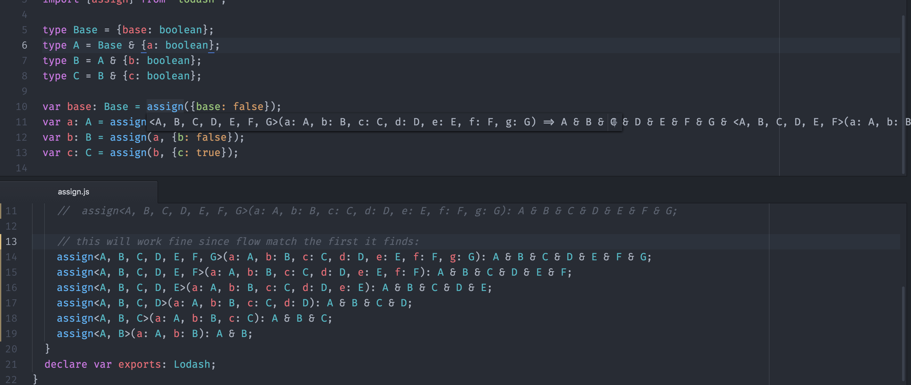

# Flow's variadic function type selection ordering defect

As of 0.31, there is still a problem where Flow does not seem to know how to select the correct signature to use based on the number of arguments supplied. As this is a very common signature used in Javascript, I consider this to be a defect.

Snippets:

from libs/assign.js:

```js
// if this line is removed, the following gets selected correctly:
assign<A>(a: A): A;
// likewise:
assign<A, B>(a: A, b: B): A & B;
assign<A, B, C>(a: A, b: B, c: C): A & B & C;
[...]
```

from index.js:

```js
type Base = {base: boolean};
type A = Base & {a: boolean}; // property a not found in object type
type B = A & {b: boolean};

var base: Base = assign({base: false});
var a: A = assign(base, {a: true}); // property a not found in object type
var b: B = assign(a, {b: false}); // intersection This type is not compatible with object type: [cascading failure]
```

If you reverse the order of definitions from the highest arity going down, then this will work. But who writes definitions this way? The nuclide people certainly didn't.

It also doesn't do what I thought it would:


